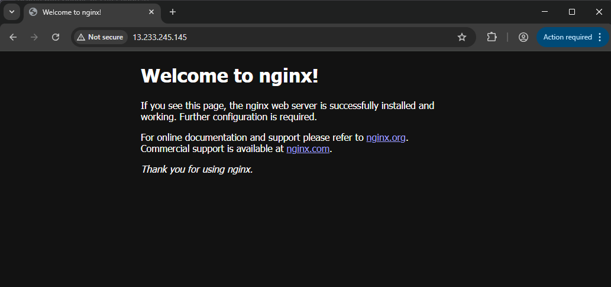

# Project 3: EC2 + Nginx Web Server

## What I built
Launched an EC2 instance on AWS, installed Nginx web server,
configured Security Groups, and served a webpage over HTTP
accessible from any browser.

## What I learned
- EC2 is a raw virtual machine — unlike S3, nothing comes
  pre-installed, you configure everything yourself
- Security Groups act like ACLs — control inbound and outbound
  traffic at the instance level
- Nginx is a web server that listens on port 80 and serves
  HTTP requests
- systemctl is used to start and enable services on Linux
- Terminating an instance is permanent — stopping just pauses it
  and EBS storage keeps billing

## What tripped me up
- Browser automatically tries HTTPS instead of HTTP — had to
  explicitly type http:// to reach the Nginx page
- Security Group inbound rule for port 80 needed to be added
  manually — it was not added by default during launch

## Screenshots

## Cert relevance
SAA-C03 - EC2 (instance types, AMIs, key pairs), Security Groups
(inbound/outbound rules), EBS storage